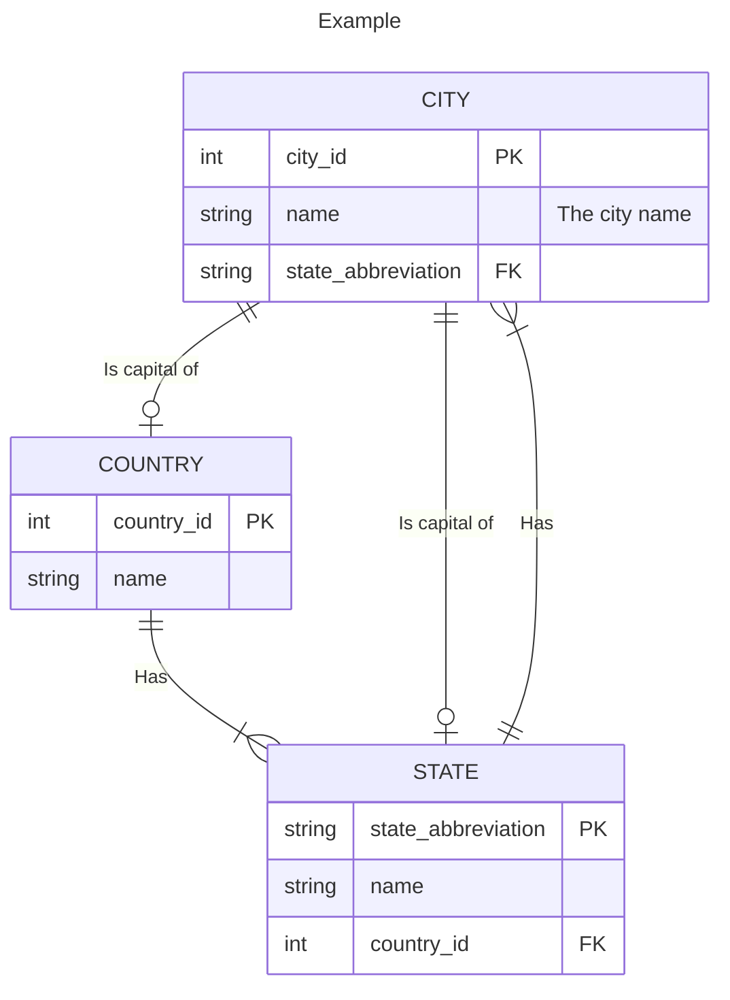

# webapi_playground

```mermaid
---
title: Example
---
erDiagram
    CITY {
        int city_id PK
        string name "The city name"
        string state_abbreviation FK
    }
    STATE {
        string state_abbreviation PK
        string name
        int country_id FK
    }
    COUNTRY {
        int country_id PK
        string name
    }
    COUNTRY ||--|{ STATE : "Has"
    STATE ||--|{ CITY : "Has"
    CITY ||--o| STATE : "Is capital of"
    CITY ||--o| COUNTRY : "Is capital of"
```