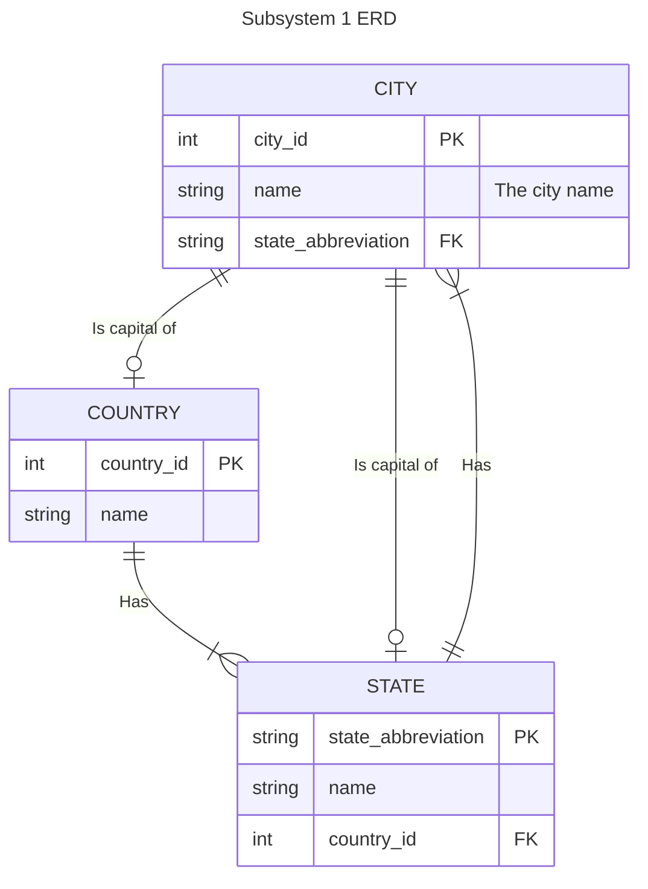
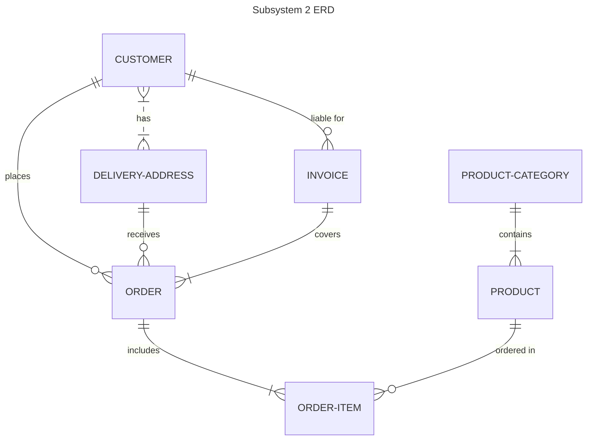

# Subsystem 1

```mermaid
---
title: Subsystem 1 ERD
---
erDiagram
    CITY {
        int city_id PK
        string name "The city name"
        string state_abbreviation FK
    }
    STATE {
        string state_abbreviation PK
        string name
        int country_id FK
    }
    COUNTRY {
        int country_id PK
        string name
    }
    COUNTRY ||--|{ STATE : "Has"
    STATE ||--|{ CITY : "Has"
    CITY ||--o| STATE : "Is capital of"
    CITY ||--o| COUNTRY : "Is capital of"
```

## Notes

### Table Info

blah blah blah

# Subsystem 2

```mermaid
---
title: Subsystem 2 ERD
---
erDiagram
    CUSTOMER }|..|{ DELIVERY-ADDRESS : has
    CUSTOMER ||--o{ ORDER : places
    CUSTOMER ||--o{ INVOICE : "liable for"
    DELIVERY-ADDRESS ||--o{ ORDER : receives
    INVOICE ||--|{ ORDER : covers
    ORDER ||--|{ ORDER-ITEM : includes
    PRODUCT-CATEGORY ||--|{ PRODUCT : contains
    PRODUCT ||--o{ ORDER-ITEM : "ordered in"
```

## Notes

### Table Info

asdlqwd qwdlkhqwkdjh